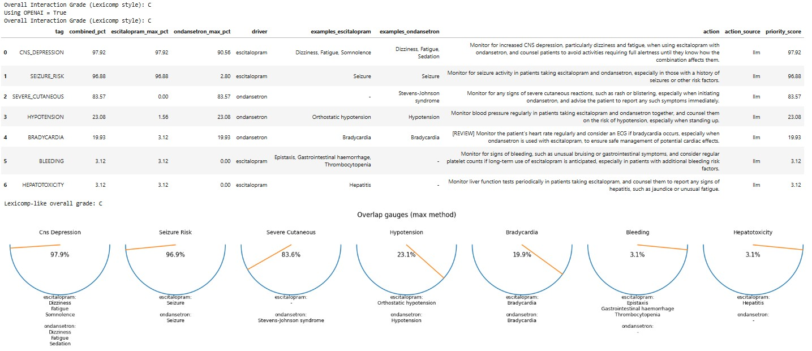

# Drug Utilization Review (DUR) Dashboard

Tool that utlizies the ONEsides database OnSIDES database: Extracting adverse drug events from drug labels using natural language processing models (https://pubmed.ncbi.nlm.nih.gov/40179876/) and utilizies RxNorm mapping and adverse-event analytics to highlight the most frequent interactions as percentage-based gauges—transforming complex DUR data into actionable clinical insight for pharmacists

